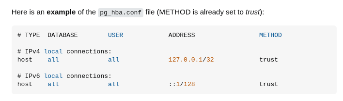

# Проект по визуализации геоданных

## Установка

### Linix (Ubuntu)

Установка python на систему.

```bash
sudo apt install python3-full
```

Активировать виртуальную среду из корневой папки проекта

```bash
source ./bin/activate
pip install --upgrade pip
```

Необходимо установить библиотеки. Вы можете это сделать с помощью команды:

```bash
pip install flask folium pandas sqlalchemy psycopg2-binary geoalchemy2 geopandas
```

#### Пометка

_В случае возникновения ошибок при установке, прочитайте, что вывела команда. Там будет описана проблема и
дополнительные инструкции по её устранению (а именно, что ещё нужно установить и команда для выполнения)._

## Настройка базы данных

Установить PostgreSQL

```bash
sudo apt install postgresql
```

#### Пометка

_На Ubuntu необходимо редактировать файл конфигурации postgresql для того, чтобы были права подключения к БД._
_Для этого откройте файл /var/lib/postgres/data/pg_hba.conf от имени администратора и редактируйте ipv4 и ipv6 заменив метод на "trust"._



Подключиться к бд

```bash
sudo -u postgres psql
```

Изменить пароль (ради примера будет 123123)

```SQL
ALTER USER postgres PASSWORD '123123';
```

Создать базу данных

```SQL
CREATE DATABASE geodata
WITH
OWNER postgres
ENCODING 'UTF8'
LC_COLLATE = 'ru_RU.UTF-8'
LC_CTYPE = 'ru_RU.UTF-8'
TEMPLATE template0;
```

Подключиться к базе данных

```SQL
\c geodata
```

Создать таблицу данных

```SQL
CREATE TABLE dataset (
    id SERIAL PRIMARY KEY, 
    polygon_id INTEGER,
    period VARCHAR(10),
    station_name VARCHAR(255), 
    surveillance_zone_characteristics TEXT, 
    adm_area VARCHAR(255),   
    district VARCHAR(255),  
    parameter VARCHAR(255), 
    monthly_average DECIMAL,
    monthly_average_pdkss DECIMAL,
    longitude DECIMAL,
    latitude DECIMAL 
);
```

## Добавление данных из файла CSV в БД

Переместить датасет в корневую папку PostgresSQL

```bash
sudo cp data.csv /var/lib/postgres/
```

Добавить датасет в базу данных

```bash
\copy dataset(polygon_id, period, station_name, surveillance_zone_characteristics, adm_area, district, parameter, monthly_average, monthly_average_pdkss, longitude, latitude) FROM '~/data.csv' DELIMITER ';' CSV HEADER;
```

#### Пометка

_**CSV HEADER** используется для игнорирования первой строки в CSV файле, в случае, когда в нём первая строка - это названия колонок в датасете._